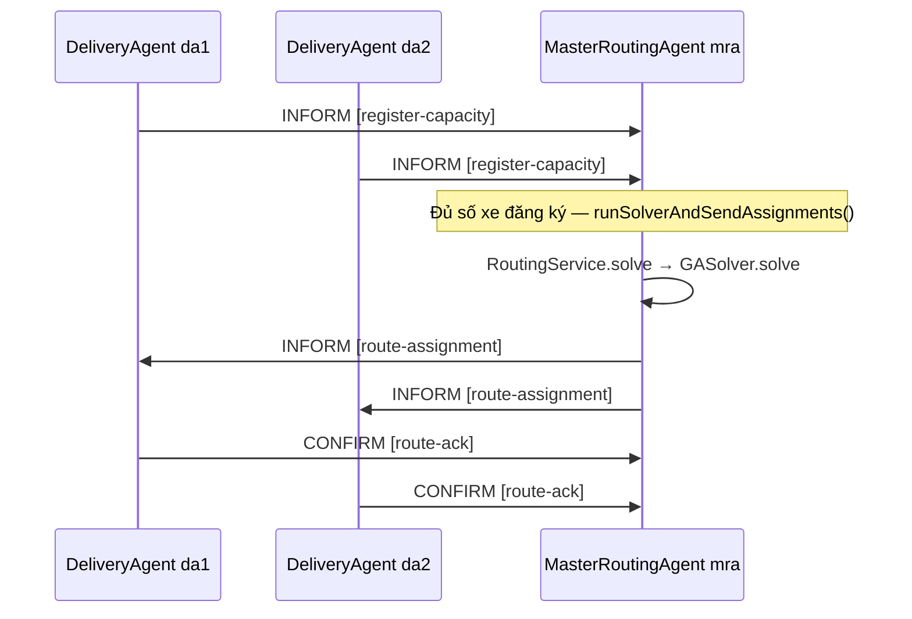

# BÁO CÁO ĐỒ ÁN MÔN HỌC

**COS30018 – Intelligent Systems**  
**Project Assignment – Option A**  
**Delivery Vehicle Routing System**

---

## Trang bìa (Cover Page)

| Thông tin | Nội dung |
|-----------|----------|
| **Trường / Khoa** | *(điền)* |
| **Môn học** | COS30018 – Intelligent Systems |
| **Đề tài** | *Delivery Vehicle Routing System* (Option A) |
| **Thành viên nhóm** | *(Họ tên – MSSV – tỷ lệ đóng góp % nếu cần)* |
| **Giảng viên / Tutor** | *(điền)* |
| **Ngày nộp** | *(điền)* |

**Khai báo đóng góp (Who did what)**  
*(Theo yêu cầu đề bài: khai báo rõ từng thành viên phụ trách phần nào — điền bảng dưới đây.)*

| Thành viên | Công việc chính |
|------------|-----------------|
| *(Tên – MSSV)* | *(ví dụ: JADE agents, GA, GUI, báo cáo, video)* |
| … | … |

---

## Mục lục (Table of Contents)

*(Khi chuyển sang Microsoft Word: dùng **References → Table of Contents** để tạo mục lục tự động và đánh số trang toàn văn. Cấu trúc logic của báo cáo này như sau.)*

1. Tóm tắt  
2. Giới thiệu (Introduction)  
3. Kiến trúc tổng thể hệ thống (Overall system architecture)  
4. Giao thức tương tác đã triển khai (Implemented interaction protocols)  
5. Kỹ thuật tìm kiếm / tối ưu đã triển khai (Implemented search/optimization techniques)  
6. Triển khai hệ thống (System implementation)  
7. Kịch bản và minh họa (Scenarios / examples)  
8. Phân tích phê phán (Critical analysis)  
9. Kết luận (Summary / Conclusion)  
10. Tài liệu tham khảo (References)  
11. Phụ lục  

---

## 1. Tóm tắt

Báo cáo trình bày hệ thống **định tuyến xe giao hàng** (Vehicle Routing Problem, VRP) theo Option A môn COS30018. Hệ thống gồm **Master Routing Agent (MRA)** và nhiều **Delivery Agent (DA)** trên nền **JADE**, trao đổi theo **giao thức ACL** có `conversationId` xác định. MRA tổng hợp ràng buộc từ các DA và danh sách kiện hàng, sau đó gọi **thuật toán di truyền (Genetic Algorithm)** do nhóm **tự cài đặt** trong Java (`GASolver`) để tìm phân bổ tuyến đường. Mục tiêu tối ưu **ưu tiên số kiện giao được**, sau đó **giảm tổng quãng đường**; đồng thời tôn trọng **capacity** từng xe và **quãng đường tối đa** từng xe. Khoảng cách giữa hai điểm được tính theo **khoảng cách Euclidean** trên mặt phẳng tọa độ, phù hợp đặc tả đề bài.

Ngoài demo JADE, nhóm triển khai **giao diện web** (React, TypeScript, Vite) và **API HTTP** (`BackendApiServer`, cổng 8080) dùng chung lõi tối ưu với JADE, hỗ trợ nhập liệu, tham số GA, tải/xuất cấu hình và **trực quan hóa** tuyến đường cùng chi phí từng route.

**Từ khóa:** VRP, multi-agent, JADE, ACL, Genetic Algorithm, capacity constraint, maximum route distance.

---

## 2. Giới thiệu (Introduction)

### 2.1 Bối cảnh

**Bài toán định tuyến xe (VRP)** thuộc lớp bài toán tối ưu tổ hợp: cần xác định tuyến đường cho một hoặc nhiều phương tiện phục vụ tập điểm khách hàng sao cho một hoặc nhiều tiêu chí (quãng đường, chi phí, thời gian…) đạt giá trị tốt. Trong thực tế, VRP và các biến thể được ứng dụng rộng rãi trong **logistics**, **thương mại điện tử**, **giao hàng đô thị** (ví dụ các nền tảng giao nhận, vận tải tích hợp).

Đề tài Option A yêu cầu xây dựng hệ **đa agent** với MRA và nhiều DA, có **giao thức phối hợp** rõ ràng (kèm **sơ đồ trình tự** trong báo cáo); MRA phải dùng **một kỹ thuật tối ưu do sinh viên triển khai** (có thể tham chiếu OR-Tools/OptaPlanner làm baseline nhưng **không** thay thế bằng thư viện đó làm solver chính); có **GUI** và **file cấu hình mặc định**; chi phí/thời gian giữa hai điểm tính theo **đường thẳng** giữa chúng.

### 2.2 Phát biểu bài toán trong phạm vi đồ án

- Có **nhiều xe** (mỗi xe ứng với một DA trong JADE, hoặc một bản ghi `Vehicle` trong JSON gửi API).  
- Có **nhiều điểm giao** (delivery item), mỗi điểm có tọa độ `(x, y)` và định danh.  
- **Kho (warehouse):** điểm xuất phát và kết thúc của mỗi chuyến. Trong mã nguồn: luồng JADE dùng `RoutingRequest.withDefaults` với `Warehouse.defaultWarehouse()` tại **`(0, 0)`**; luồng web lấy tọa độ kho từ JSON (giao diện thường đặt mặc định gần trung tâm vùng bản đồ, ví dụ `(50, 50)`).  

**Mục tiêu (theo đề và theo cài đặt):**

1. **Tối đa hóa** số kiện giao được (`deliveredCount`).  
2. **Với cùng số kiện đã giao, tối thiểu hóa** tổng quãng đường toàn hệ (`totalDistance`).  

Trong `GASolver.java`, thứ tự ưu tiên được thể hiện bởi `SOLUTION_COMPARATOR` và hàm thích nghi  
`fitness = deliveredCount × 1_000_000 − totalDistance`.  
Khi tổng capacity hoặc giới hạn quãng đường không cho phép giao hết, các kiện còn lại được liệt kê trong **`undeliveredItemIds`** — hệ thống **không** giả định luôn giao đủ mọi kiện.

### 2.3 Mục tiêu đồ án

- Xây dựng **MAS trên JADE**: `MasterRoutingAgent`, `DeliveryAgent`, khởi chạy từ `Main.java`.  
- Triển khai **GA** trong `optimizer/GASolver.java`, gọi thống nhất qua `service/RoutingService.java`.  
- Cung cấp **GUI** nhập tham số, sinh/tải dữ liệu, **trực quan hóa** route và chi phí; kết nối backend qua **`POST /solve`**.  
- Đáp ứng **Basic Requirement 1** (ưu tiên số kiện, xử lý khi tổng capacity nhỏ hơn số kiện) và **Basic Requirement 2** (giới hạn quãng đường từng xe).

### 2.4 Phạm vi và giới hạn

**Trong phạm vi:** một kho chung; khoảng cách Euclidean; ràng buộc capacity và `maxDistance` theo từng xe.  

**Ngoài phạm vi code hiện tại:** giao thông thực tế; **VRPTW** (Extension Option 1); mô hình **đấu thầu** DA–MRA (Extension Option 2).

---

## 3. Kiến trúc tổng thể hệ thống (Overall system architecture)

### 3.1 Tổng quan

Lõi tối ưu được viết bằng **Java** và được tái sử dụng trong **hai chế độ triển khai**:

**Chế độ A – Đa agent JADE**  
Người dùng chạy `Main.java`: khởi tạo container JADE (có thể bật GUI quản lý agent), tạo agent **`mra`** (`MasterRoutingAgent`) và các agent **`da1`, `da2`, …** (`DeliveryAgent`). MRA nạp danh sách kiện từ **file văn bản** (`DeliveryItemParser`, mặc định `data/items.txt`). Khi đủ số DA đã đăng ký capacity, MRA gọi `RoutingService.solve(...)` rồi gửi lịch trình cho từng DA qua ACL. DA xác nhận nhận route bằng tin **ACK**.

**Chế độ B – Ứng dụng web + API**  
Người dùng cấu hình trên **React** (`SetupPage`), chuyển sang trang **Visualization**; ứng dụng gửi **JSON** tới **`http://localhost:8080/solve`**. `BackendApiServer` chuyển JSON thành `RoutingRequest` và gọi cùng `RoutingService` / `GASolver`. Kết quả trả về gồm các route, kiện chưa giao, và các chỉ số GA. Giao diện vẽ bản đồ và hiển thị **chuỗi tin nhắn** tương ứng giai đoạn đăng ký capacity, phân công route và ACK — **mô phỏng** luồng giao tiếp đã mô tả trong JADE, sau khi đã có nghiệm từ backend.

Sơ đồ khối tổng thể:

```
┌──────────────────────────────────────────────────────────────┐
│  Lớp trình bày: React (SetupPage, VisualizationPage,        │
│  MapVisualization, AgentCommunication, SolutionStats)        │
└────────────────────────────┬─────────────────────────────────┘
                             │ HTTP POST /solve (JSON)
┌────────────────────────────▼─────────────────────────────────┐
│  BackendApiServer.java — cổng 8080                            │
└────────────────────────────┬─────────────────────────────────┘
                             │ RoutingService.solve(RoutingRequest)
┌────────────────────────────▼─────────────────────────────────┐
│  GASolver, DistanceCalculator, các lớp model.*                │
└────────────────────────────▲─────────────────────────────────┘
                             │ cùng RoutingService
┌────────────────────────────┴─────────────────────────────────┐
│  JADE: MasterRoutingAgent — DeliveryAgent × N                 │
└──────────────────────────────────────────────────────────────┘
```

*(Khi nộp bản Word/PDF: nên thay sơ đồ ASCII bằng **hình vẽ** kiến trúc trong draw.io hoặc tương đương.)*

### 3.2 Thành phần chính

**Master Routing Agent (`MasterRoutingAgent.java`)**  
Thu thập `VehicleInfo` qua tin `register-capacity`; đọc kiện từ file; khi `vehicles.size()` đạt `expectedVehicles`, gọi solver và phát `route-assignment` cho từng xe.

**Delivery Agent (`DeliveryAgent.java`)**  
Gửi một lần thông tin `vehicleId`, `capacity`, `maxDistance`; lắng nghe `route-assignment`; phản hồi `route-ack`.

**GUI (`frontend/Vehicle-Routing-System-main/`)**  
Nhập kho, kiện, xe, tham số GA; sinh ngẫu nhiên hoặc kịch bản có sẵn; tải `.json` hoặc file text dòng `id,x,y`; xuất cấu hình JSON; hiển thị kết quả tối ưu và bản đồ.

**Mô hình dữ liệu (`model/`)**  
`DeliveryItem` (id, x, y); `VehicleInfo` (vehicleId, capacity, maxDistance); `Warehouse`; `RouteAssignment`; `RoutingRequest` / `RoutingResponse`; `GAConfig`.

---

## 4. Giao thức tương tác đã triển khai (Implemented interaction protocols)

### 4.1 Mô tả giao thức

Luồng triển khai trong mã JADE như sau.

1. **DA → MRA:** `ACLMessage` kiểu **`INFORM`**, `conversationId = "register-capacity"`. Nội dung chuỗi ASCII dạng `key=value` phân tách bởi `;`, ví dụ:  
   `vehicleId=da1;capacity=3;maxDistance=100.0`.

2. **MRA:** `CyclicBehaviour` nhận tin; `parseVehicleInfo` tách các trường và lưu vào `Map<String, VehicleInfo>`.

3. **MRA:** Khi đủ số xe đã đăng ký, thực thi `runSolverAndSendAssignments()`: gọi `RoutingService` → `GASolver`, sau đó với mỗi `RouteAssignment` gửi **`INFORM`**, `conversationId = "route-assignment"`, nội dung gồm `vehicleId`, danh sách `items`, `distance`.

4. **DA → MRA:** Sau khi nhận route, DA gửi **`CONFIRM`**, `conversationId = "route-ack"`, nội dung ví dụ `vehicleId=...;status=RECEIVED`.

5. **MRA** ghi nhận ACK trên console.

**Điều kiện kích hoạt solver:** `expectedVehicles` truyền vào MRA khi tạo agent (trong `Main.java` mặc định là `2`). Số DA thực tế phải khớp để MRA chạy GA đúng một lần theo logic `routesSent`.

### 4.2 Sơ đồ trình tự (Sequence diagram — bắt buộc theo đề)

Bảng ánh xạ thao tác trừu tượng với mã:

| Thao tác (khái niệm) | Cài đặt |
|----------------------|---------|
| Gửi capacity | `INFORM` + `register-capacity` (`DeliveryAgent`) |
| Tính route | `RoutingService.solve` → `GASolver.solve` (`MasterRoutingAgent`) |
| Gửi route | `INFORM` + `route-assignment` |

Sơ đồ UML (Mermaid — xuất PNG từ trình soạn thảo hỗ trợ Mermaid để chèn vào báo cáo Word):



### 4.3 Ngôn ngữ / định dạng trao đổi

| Kênh | Định dạng |
|------|-----------|
| JADE MRA ↔ DA | **FIPA ACL** (`ACLMessage`) + nội dung chuỗi có cấu trúc `key=value;...` |
| Client web ↔ Backend | **JSON** qua HTTP POST |
| File kiện (JADE / `BackendDemoRunner`) | Mỗi dòng: `id,x,y` |

---

## 5. Kỹ thuật tìm kiếm / tối ưu đã triển khai (Implemented search/optimization techniques)

### 5.1 Phát biểu đầu vào — đầu ra

**Đầu vào:** danh sách kiện (tọa độ), danh sách xe (capacity, maxDistance), tọa độ kho, tham số GA.  

**Đầu ra:** map `vehicleId` → `RouteAssignment` (thứ tự kiện và `totalDistance` route); danh sách kiện chưa giao; tổng số kiện đã giao; tổng quãng đường; fitness và thế hệ tốt nhất của GA.

### 5.2 Hàm mục tiêu

So sánh nghiệm theo thứ tự **từ điển**: trước hết **nhiều kiện giao hơn**; nếu bằng thì **tổng quãng đường nhỏ hơn**. Hàm scalar  
`fitness = deliveredCount × 10^6 − totalDistance`  
đảm bảo khi chọn lọc theo tournament và elitism, nghiệm ưu tiên đúng thứ tự trên.

### 5.3 Thuật toán: Genetic Algorithm (`GASolver.java`)

Nhóm **tự cài đặt GA** trong Java; **không** dùng OR-Tools hay OptaPlanner làm bộ giải chính trong mã nguồn solver.

**Mã hóa:** mỗi cá thể là **hoán vị** `n` chỉ số kiện `0 … n−1`.  

**Giải mã:** duyệt gene theo thứ tự; với mỗi kiện, thử gán lần lượt các xe (quay vòng) trong giới hạn số lần thử; chấp nhận gán nếu không vượt **capacity** và **maxDistance** của xe (quãng đường tính: kho → các điểm theo thứ tự trên xe → kho). Kiện không gán được → `undelivered`.

**Toán tử di truyền:**  
- Chọn lọc: **tournament** (`tournamentSize`).  
- Lai: **Order Crossover (OX)** với xác suất `crossoverRate`.  
- Đột biến: **đổi chỗ hai gene** với xác suất `mutationRate`.  
- **Elitism:** giữ `eliteSize` cá thể tốt nhất.

**Tham số mặc định** (`GAConfig.defaultConfig()`): `populationSize = 40`, `generations = 100`, `tournamentSize = 3`, `eliteSize = 1`, `crossoverRate = 0.8`, `mutationRate = 0.2`. Giao diện có thể gửi `populationSize`, `generations`, `mutationRate`, `eliteSize` trong JSON; các trường khác dùng mặc định nếu thiếu.

**Kiểm chứng:** `validateDecodeResult` đảm bảo không trùng kiện, không vi phạm ràng buộc, và khớp tổng số kiện.

### 5.4 Xử lý ràng buộc

| Ràng buộc | Cách thực hiện |
|-----------|----------------|
| Capacity | Số kiện trên mỗi xe không vượt `capacity` |
| Max distance | `totalDistance` route ≤ `maxDistance` |
| Depot | Route đóng: xuất phát và kết thúc tại warehouse |
| Không đủ năng lực giao hết | Kiện còn lại trong `undeliveredItemIds` |

### 5.5 Độ phức tạp thời gian (ước lượng)

Gọi \(n\) số kiện, \(P\) quy mô quần thể, \(G\) số thế hệ, \(k\) số xe. Mỗi lần giải mã một nhiễm sắc thể có chi phí trong **trường hợp xấu** khoảng **\(O(n^2 k)\)** do vòng gene và thử xe kèm tính lại quãng đường. Một thế hệ: **\(O(P \cdot n^2 k)\)**; toàn bộ GA: **\(O(G \cdot P \cdot n^2 k)\)**. Bộ nhớ lưu quần thể **\(O(P \cdot n)\)**. Khi \(n\) hoặc \(G\) lớn, thời gian tăng nhanh; có thể điều chỉnh tham số trên GUI hoặc tối ưu triển khai (ví dụ cache ma trận khoảng cách).

---

## 6. Triển khai hệ thống (System implementation)

### 6.1 Công nghệ sử dụng

| Thành phần | Công nghệ |
|------------|-----------|
| Ngôn ngữ lõi | Java |
| Nền đa agent | JADE |
| API | `com.sun.net.httpserver.HttpServer`, cổng **8080** |
| Phân tích JSON (request) | `javax.script.ScriptEngine` / `Java.asJSONCompatible` |
| Giao diện | React, TypeScript, Vite |

### 6.2 Tính năng chính (theo mã nguồn)

- Sinh dữ liệu kiện **tự động** (ngẫu nhiên, hoặc kịch bản **balanced**, **overcapacity**, **limited** trên `SetupPage`).  
- **Đọc file:** JSON cấu hình đầy đủ hoặc văn bản `id,x,y` từng dòng.  
- **Xuất** cấu hình JSON.  
- **`BackendDemoRunner`:** chạy solver từ file kiện, in kết quả console (hai xe `da1`/`da2` cố định).  
- **Trực quan hóa:** bản đồ route, thống kê, panel giao tiếp agent.

### 6.3 Luồng xử lý tóm tắt

**JADE:** Khởi tạo container → khởi động MRA và các DA → DA gửi capacity → MRA đạt đủ số đăng ký → đọc file kiện → tối ưu → phát route → DA gửi ACK.  

**Web:** Cấu hình trên Setup → Visualization → POST JSON → nhận solution → hiển thị.

---

## 7. Kịch bản và minh họa (Scenarios / examples)

### 7.1 Kịch bản đủ capacity và khoảng cách

- Chạy **`Main.java`** hoặc **`BackendDemoRunner`** với `data/items.txt` (sáu kiện mẫu) và hai xe như trong `Main` / `BackendDemoRunner`.  
- Hoặc trên GUI: kịch bản **balanced** (15 kiện, ba xe capacity 5, maxDistance 120), chạy tối ưu và quan sát **tổng kiện đã giao** và **quãng đường từng xe**.

### 7.2 Kịch bản tổng capacity nhỏ hơn số kiện (Basic Requirement 1)

- GUI: kịch bản **overcapacity** (25 kiện, tổng capacity xe nhỏ hơn 25).  
- **Kết quả kỳ vọng:** một phần kiện nằm trong **undelivered**; GA ưu tiên tối đa số kiện có thể giao trong không gian heuristic.

### 7.3 Kịch bản giới hạn quãng đường (Basic Requirement 2)

- GUI: kịch bản **limited** (kiện gần và xa kho; `maxDistance` chặt, ví dụ 70).  
- **Kết quả kỳ vọng:** mỗi route không vượt `maxDistance`; kiện quá xa có thể không được gán.

### 7.4 Minh họa báo cáo (hình ảnh cần đính kèm)

Theo rubric GUI và báo cáo, bản nộp nên gồm **ảnh chụp màn hình**: (1) trang Setup với kho, xe, tham số GA; (2) trang Visualization với **bản đồ route** (màu theo xe), **thống kê**, và **Agent Communication**.

---

## 8. Phân tích phê phán (Critical analysis)

### 8.1 Ưu điểm

- Đáp ứng **cấu trúc đa agent JADE** và **giao thức ACL** có sơ đồ trình tự minh họa được.  
- **GA tự triển khai** đầy đủ thành phần (mã hóa, giải mã ràng buộc, lai, đột biến, chọn lọc, elitism, kiểm tra nội bộ).  
- **Hai kênh demo** (JADE và web) dùng chung `RoutingService` / `GASolver`, thuận tiện trình diễn và đánh giá.  
- GUI hỗ trợ **kịch bản** minh họa trực tiếp hai yêu cầu cơ bản của đề.

### 8.2 Hạn chế

- GA kết hợp decode **tham lam theo thứ tự gene** **không đảm bảo** nghiệm tối ưu toàn cục; chất lượng phụ thuộc tham số và khởi tạo.  
- Thứ tự **xoay vòng thử xe** trong decode ảnh hưởng mạnh tới kết quả.  
- Trên web, **chuỗi tin agent** được **tái dựng** sau khi có kết quả API; cần làm rõ trong demo/báo cáo để phân biệt với message JADE thời gian thực.  
- Parse JSON bằng ScriptEngine có thể gặp hạn chế tùy phiên bản JDK.

### 8.3 Hướng cải tiến

- Mở rộng **VRPTW** hoặc **trọng lượng kiện**.  
- Tích hợp **bản đồ đường** thay cho Euclidean thuần túy.  
- Cải thiện decode (ví dụ gán theo nhóm rồi tối ưu thứ tự từng route) hoặc **local search** sau GA.  
- Chuẩn hóa API JSON bằng thư viện **Jackson/Gson**.  
- Cho phép MRA nhận danh sách kiện qua ACL để đồng bị với mô tả “input từ hệ thống” hoàn toàn trên agent.

---

## 9. Kết luận (Summary / Conclusion)

Đồ án đã xây dựng **hệ thống định tuyến xe giao hàng** theo Option A COS30018: **MRA và nhiều DA trên JADE** với **giao thức tương tác rõ ràng**; **thuật toán di truyền tự cài đặt** giải bài toán với **ưu tiên số kiện giao**, **ràng buộc capacity và quãng đường tối đa**, và **khoảng cách Euclidean**; kèm **giao diện web** và **API** phục vụ nhập liệu, tham số và **trực quan hóa** route cùng chi phí. Các hướng **mở rộng nghiên cứu** (time window, đấu thầu, bản đồ thực) có thể phát triển tiếp trên nền kiến trúc hiện tại.

---

## 10. Tài liệu tham khảo (References)

1. Google Developers. *Vehicle Routing Problem*. https://developers.google.com/optimization/routing/vrp  
2. Google Developers. *Vehicle Routing Problem with Time Windows*. https://developers.google.com/optimization/routing/vrptw  
3. Bellifemine, F. L., Caire, G., & Greenwood, D. *Developing Multi-Agent Systems with JADE*. Wiley. (hoặc tài liệu chính thức JADE.)  
4. Swinburne University of Technology. **COS30018 – Project Assignment – Option A** (tài liệu đề bài PDF).  
5. *(Tùy chọn)* Tài liệu khảo sát VRP / meta-heuristic (GA) nếu nhóm trích dẫn thêm trong bản Word.

---

## Phụ lục A — Ánh xạ nhanh với rubric đề bài (gợi ý)

| Hạng mục đề bài | Vị trí trong báo cáo / mã |
|-----------------|---------------------------|
| Task 1: MRA–DA, giao thức, sequence | Mục 4; `MasterRoutingAgent`, `DeliveryAgent` |
| Task 2: Tối ưu, Basic Req. 1 | Mục 5; `GASolver`, fitness, undelivered |
| Task 3: Basic Req. 2 (max distance) | Mục 5.4; `decode`, `maxDistance` |
| GUI: route + cost | Mục 3, 7; `VisualizationPage`, `MapVisualization` |

---

## Phụ lục B — File nguồn chính

| Vai trò | Đường dẫn |
|---------|-----------|
| MRA | `src/agents/MasterRoutingAgent.java` |
| DA | `src/agents/DeliveryAgent.java` |
| Khởi chạy JADE | `src/Main.java` |
| GA | `src/optimizer/GASolver.java` |
| Dịch vụ định tuyến | `src/service/RoutingService.java` |
| API HTTP | `src/BackendApiServer.java` |
| Demo console | `src/BackendDemoRunner.java` |
| Parser kiện | `src/parser/DeliveryItemParser.java` |
| Khoảng cách | `src/util/DistanceCalculator.java` |
| Frontend | `frontend/Vehicle-Routing-System-main/` |

---

*Bản báo cáo trình bày hoàn chỉnh — điền trang bìa, mục lục tự động và hình minh họa khi xuất bản Word/PDF (khuyến nghị độ dài 8–10 trang theo đề bài).*
