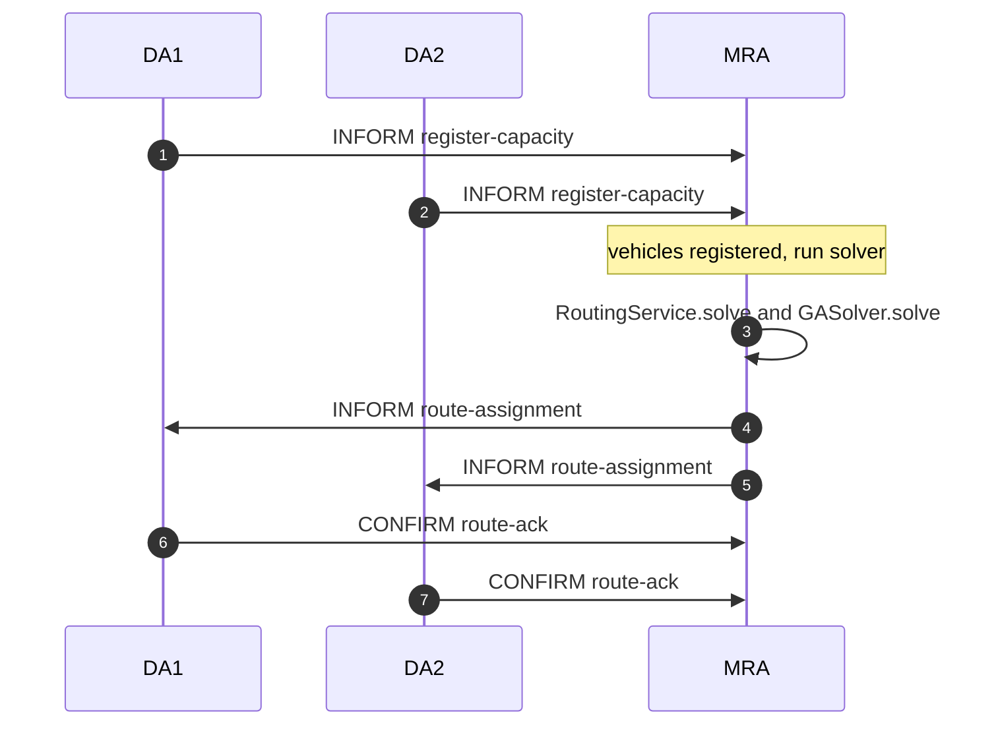

# Sequence diagram — Hướng dẫn vẽ trên draw.io (diagrams.net)

Tài liệu này mô tả **các bước (lệnh thao tác)** và **nội dung copy-paste** để có **UML Sequence Diagram** cho giao thức **MRA ↔ Delivery Agents** đúng với mã JADE (`register-capacity` → solver → `route-assignment` → `route-ack`).

---

## Cách 1 — Nhập Mermaid (nhanh nhất, khuyến nghị)

### Quan trọng — tránh lỗi `UnknownDiagramError`

draw.io **không phải** Markdown. Trong hộp thoại **Mermaid** bạn chỉ được dán **mã Mermaid thuần**:

- **Không** dán dòng ` ```mermaid ` hoặc ` ``` ` (ba dấu backtick).
- **Không** dán **hai lần** cùng một khối.
- **Không** dùng thẻ HTML như `<br/>` trong nhãn — bản Mermaid nhúng trong diagrams.net thường **lỗi**.
- **Không** dùng ký tự mũi tên Unicode `→`; dùng chữ `and` hoặc gạch ngang.

Hoặc mở file **`docs/mra-da-sequence.mmd`** trong editor, copy **toàn bộ** nội dung (đã là Mermaid thuần) rồi dán vào draw.io.

### Các bước

1. Mở **https://app.diagrams.net/** (hoặc **https://draw.io**).
2. **File → New Diagram** (hoặc diagram trống).
3. **Arrange → Insert → Advanced → Mermaid…**  
   *(Hoặc **+** → **Advanced → Mermaid**.)*
4. Xóa sạch ô nhập, **dán đúng** khối dưới đây (**bắt đầu bằng** `sequenceDiagram`, **không** có dòng backtick).
5. **Insert** → chỉnh layout → **File → Export as → PNG/PDF**.

### Nội dung dán vào draw.io (copy từ dòng `sequenceDiagram` đến hết)

Chỉ copy **các dòng bên trong** khối dưới — **không** copy dòng ` ``` ` phía trên/dưới (nếu có).

```
sequenceDiagram
    autonumber
    participant DA1
    participant DA2
    participant MRA

    DA1->>MRA: INFORM register-capacity
    DA2->>MRA: INFORM register-capacity
    Note over MRA: vehicles registered, run solver
    MRA->>MRA: RoutingService.solve and GASolver.solve
    MRA->>DA1: INFORM route-assignment
    MRA->>DA2: INFORM route-assignment
    DA1->>MRA: CONFIRM route-ack
    DA2->>MRA: CONFIRM route-ack
```

*(Bản đầy đủ chi tiết ACL: `conversationId` INFORM/CONFIRM, nội dung `key=value` — xem mục “Ghi chú chi tiết cho báo cáo” bên dưới hoặc vẽ thêm nhãn trên draw.io sau khi insert.)*

### Ghi chú chi tiết (chèn vào Word / nhãn trên sơ đồ)

| Bước | Performative | conversationId | Gợi ý nhãn đầy đủ |
|------|--------------|----------------|-------------------|
| DA → MRA | INFORM | `register-capacity` | `vehicleId=…;capacity=…;maxDistance=…` |
| MRA nội bộ | — | — | `runSolverAndSendAssignments`, `RoutingService` → `GASolver` |
| MRA → DA | INFORM | `route-assignment` | `vehicleId;items;distance` |
| DA → MRA | CONFIRM | `route-ack` | `vehicleId;status=RECEIVED` |

### Phiên bản Markdown (chỉ để xem trong GitHub / VS Code — không dán nguyên vào draw.io)



---

## Cách 2 — Vẽ thủ công bằng thư viện UML (draw.io)

Thực hiện lần lượt các **lệnh menu / thao tác** sau.

### Bước 1 — Tạo lifelines (3 cuộc đời tuyến)

1. **Bật hình dạng:** nhấn **`+`** (More Shapes) hoặc **Shapes** bên trái → tìm **UML** → bật **UML** → **Apply**.
2. Kéo **Lifeline** (hoặc **Actor** + đường đứt nét) vào canvas **3 lần**, đặt từ trái sang phải:
   - Nhãn: **`DA1 (DeliveryAgent)`**
   - Nhãn: **`DA2 (DeliveryAgent)`**
   - Nhãn: **`MRA (MasterRoutingAgent)`**

### Bước 2 — Các message (mũi tên)

Dùng **UML → Message** (mũi tên nét liền) hoặc kéo connector giữa hai lifeline, chỉnh **End Arrow** = mũi tên hướng đích.

| # | Từ | Đến | Kiểu / ghi chú trên nhãn |
|---|-----|-----|---------------------------|
| 1 | DA1 | MRA | `INFORM` — `register-capacity` — nội dung: `vehicleId=…;capacity=…;maxDistance=…` |
| 2 | DA2 | MRA | Giống bước 1 |
| 3 | MRA | MRA | **Self-message** (vòng lại chính MRA): `runSolverAndSendAssignments()` / `RoutingService` → `GASolver` |
| 4 | MRA | DA1 | `INFORM` — `route-assignment` — `vehicleId;items;distance` |
| 5 | MRA | DA2 | Giống bước 4 |
| 6 | DA1 | MRA | `CONFIRM` — `route-ack` — `vehicleId;status=RECEIVED` |
| 7 | DA2 | MRA | Giống bước 6 |

**Self-message trên MRA:** kéo connector từ MRA quay lại MRA (hoặc dùng điểm neo trên cùng lifeline), gõ nhãn như bảng.

### Bước 3 — Fragment ghi chú (tùy chọn)

1. Kéo **UML → Combined Fragment** (hoặc **Rectangle** bo góc + nét đứt).
2. Gõ nội dung: `vehicles.size() == expectedVehicles` và `RoutingService.solve → GASolver.solve` bao quanh bước self-call của MRA.

### Bước 4 — Đánh số thứ tự (tùy chọn)

1. Chọn từng nhãn message → thêm tiền tố **`1.`**, **`2.`**, … hoặc dùng **Text** nhỏ bên cạnh mũi tên.

### Bước 5 — Xuất file

- **File → Export as → PNG** (độ phân giải 200–300% nếu cần in).
- Hoặc **File → Save as** → định dạng **.drawio** để chỉnh sau.

---

## Cách 3 — Lệnh dòng lệnh (CLI) — tùy chọn

Nếu cần **xuất PNG từ Mermaid không qua draw.io**, có thể dùng **Mermaid CLI** (cài Node.js):

```bash
npm install -g @mermaid-js/mermaid-cli
```

Trong repo đã có sẵn **`docs/mra-da-sequence.mmd`** (cùng nội dung Mermaid). Hoặc tạo file `.mmd` tùy ý, rồi:

```bash
mmdc -i docs/mra-da-sequence.mmd -o docs/mra-da-sequence.png
```

*(Lệnh này không thuộc draw.io; chỉ để có ảnh sequence từ cùng nội dung Mermaid.)*

---

## Tham chiếu mã nguồn

| Thành phần | File |
|------------|------|
| Gửi capacity | `src/agents/DeliveryAgent.java` — `register-capacity`, `INFORM` |
| Nhận & solver & gửi route | `src/agents/MasterRoutingAgent.java` — `route-assignment`, `INFORM` |
| ACK | `src/agents/DeliveryAgent.java` — `route-ack`, `CONFIRM` |

---

*File: `docs/SEQUENCE_DIAGRAM_DRAWIO.md` — chỉnh sửa tự do khi soạn báo cáo.*
